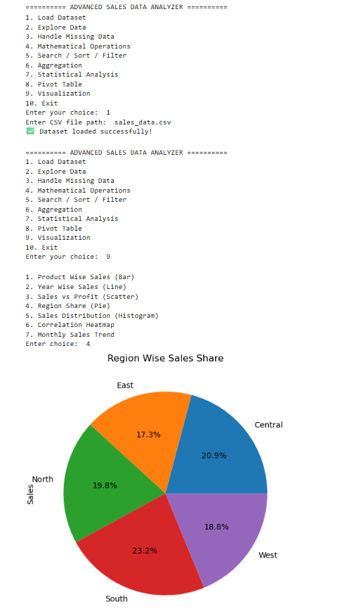

# 🚀 Python Visualizer

A beginner-friendly Python project focused on data analysis and visualization techniques using sales datasets.

## 📌 About This Project
This repository contains:
- Advanced sales data analysis
- Data exploration and filtering
- Statistical analysis
- Pivot table operations
- Data visualization using charts
- Beginner-friendly coding exercises
- AI/ML preparation content

## 📂 Files Included
- `PR.9_Visualizer.ipynb` → Jupyter Notebook containing visualization and data analysis programs
- `PR.9_Visualizer.png` → Output screenshot of the Advanced Sales Data Analyzer project

## 🛠 Technologies Used
- Python
- NumPy
- Pandas
- Matplotlib
- Jupyter Notebook

## 🎯 Learning Goals
This project helps in understanding:
- Data analysis fundamentals
- Data visualization techniques
- Statistical operations
- Sales data interpretation
- Python concepts for AI/ML

## 📸 Project Output

## 👨‍💻 Author
**Yashraj Sharma**

---
⭐ If you like this project, don't forget to star the repository.
